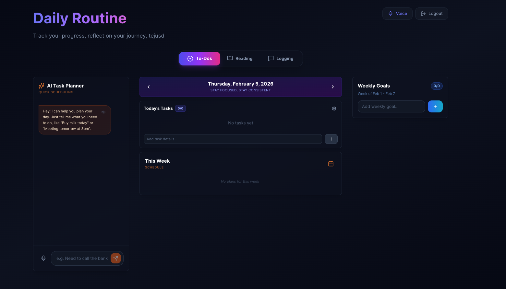
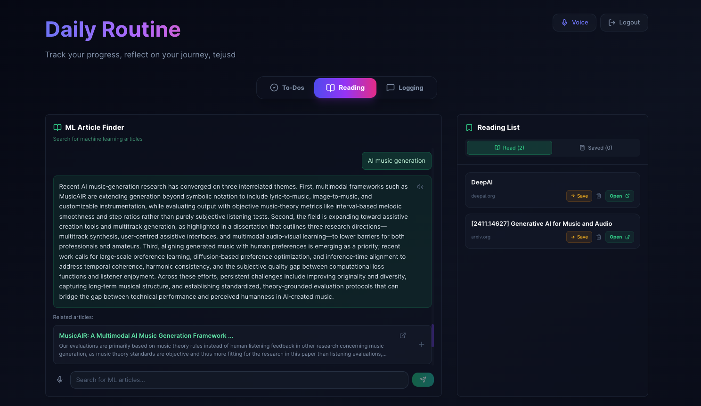
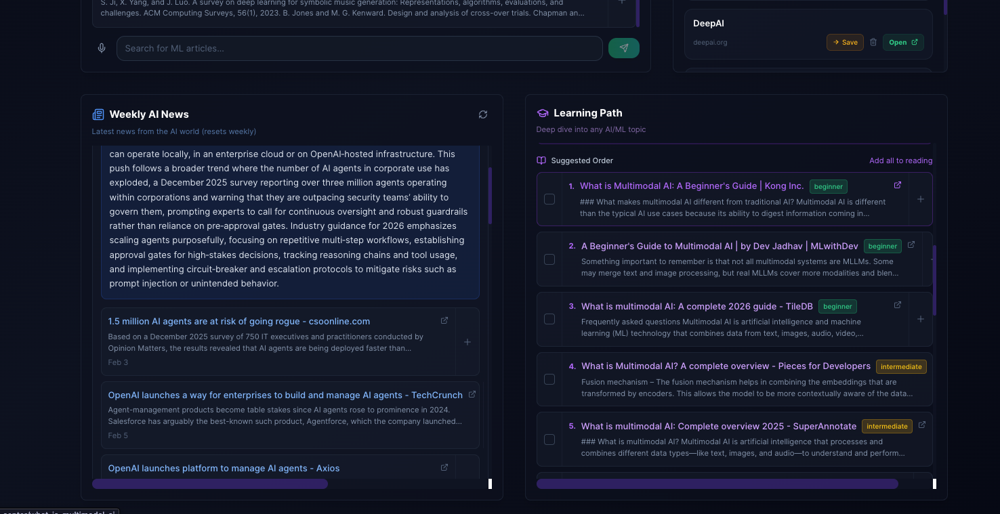

# Routine App

**An AI-powered daily routine and productivity tracker with voice control, intelligent reflections, and personalized learning paths.**


---

## Overview

Routine App combines task management, goal tracking, and daily reflection into a single cohesive experience. Unlike typical todo apps, it understands that productivity is personal -  AI-powered reflection organization, and intelligent task validation through natural language understanding, featuring a custom 12:30 AM day boundary for late night entries.

Built as a full-stack application with React and Express, it integrates Google Gemini for AI features, Tavily for research capabilities, and on-device Whisper for private voice transcription.


---

## Why This Stands Out

| Feature | Typical Apps | Routine App |
|---------|------------------|-------------|
| Task Completion | Simple checkbox | **AI-validated accountability locks** |
| Reflections | Basic notes | **Natual language input to AI-organized into structured sections** |
| Voice Input | Cloud-dependent | **On-device Whisper (private)** |
| Learning paths | None | **AI-generated learning paths with difficulty ranking** |
|

---


## Some Screenshots




---
## Key Features

- **Smart Task Management** - Daily and recurring "everyday" tasks with streak tracking, completion notes, and AI-validated task locks ([details](docs/FEATURES.md#task-management))

- **Weekly Goals** - Set and track weekly goals with progress notes ([details](docs/FEATURES.md#goal-setting))

- **AI-Powered Reflections** - Chat-style interface that uses Gemini to organize your thoughts into structured daily logs ([details](docs/FEATURES.md#reflection--logging))

- **Voice Control** - On-device speech recognition with Whisper.js - your voice data never leaves your machine ([details](docs/FEATURES.md#voice-control))

- **Learning Paths** - Generate personalized learning paths for any topic with AI-ranked difficulty levels ([details](docs/FEATURES.md#learning--research))

- **Research Tools** - Search and save articles, generate weekly news digests for AI/ML topics ([details](docs/FEATURES.md#content-discovery))

- **Natural Language Scheduling** - Describe tasks in plain English and let AI parse them into structured scheduled tasks ([details](docs/FEATURES.md#smart-scheduling))

---

## Tech Stack

| Layer | Technology | Purpose |
|-------|------------|---------|
| **Frontend** | React 19, Tailwind CSS | UI and styling |
| **Backend** | Express.js, Node.js | API server |
| **Database** | MongoDB (Mongoose) | Data persistence |
| **AI/NLP** | Google Gemini Flash | Reflection processing, task parsing, validation |
| **Search** | Tavily API | Article discovery, research, learning paths |
| **Voice** | Whisper (Transformers.js) | On-device speech recognition |
| **Audio** | FFmpeg, WaveFile | Audio format conversion |
| **Auth** | JWT, PBKDF2-SHA256 | Secure authentication |

---

## Architecture Overview

```
┌─────────────────────────────────────────────────────────────┐
│                     React Frontend                          │
│  ┌─────────┐ ┌─────────┐ ┌─────────┐ ┌─────────────────┐   │
│  │  Tasks  │ │  Goals  │ │Reflectn │ │ Learning/Reading│   │
│  └────┬────┘ └────┬────┘ └────┬────┘ └────────┬────────┘   │
│       │           │           │                │            │
│  ┌────┴───────────┴───────────┴────────────────┴────┐      │
│  │              Context Providers                    │      │
│  │         (Auth, Toast, Voice Settings)             │      │
│  └─────────────────────┬────────────────────────────┘      │
└────────────────────────┼────────────────────────────────────┘
                         │ HTTP/REST
┌────────────────────────┼────────────────────────────────────┐
│                Express Backend                               │
│  ┌─────────────────────┴────────────────────────────┐       │
│  │              Route Handlers                       │       │
│  │  /auth  /tasks  /goals  /logs  /reflection       │       │
│  │  /planner  /research  /chat  /voice              │       │
│  └──────┬───────────────┬───────────────┬───────────┘       │
│         │               │               │                    │
│    ┌────┴────┐    ┌─────┴─────┐   ┌─────┴─────┐            │
│    │ MongoDB │    │  Gemini   │   │  Tavily   │            │
│    │(Mongoose)│    │   API     │   │   API     │            │
│    └─────────┘    └───────────┘   └───────────┘            │
└──────────────────────────────────────────────────────────────┘
```

---

## Getting Started

### Prerequisites

- Node.js 18+
- MongoDB (local or Atlas)
- API keys for Gemini and Tavily (optional for basic usage)

### Installation

```bash
# Clone the repository
git clone https://github.com/yourusername/routine-app.git
cd routine-app

# Install server dependencies
npm install

# Install client dependencies
cd client && npm install && cd ..
```

### Configuration

Create a `.env` file in the root directory:

```env
# Required
MONGODB_URI=mongodb://localhost:27017/routine-app
JWT_SECRET=your-secure-random-string-here

# Optional (for AI features)
GEMINI_API_KEY=your-gemini-api-key
TAVILY_API_KEY=your-tavily-api-key

# Optional
PORT=5000
NODE_ENV=development
LOG_LEVEL=info
```

### Running the App

```bash
# Development mode (runs both server and client)
npm start

# Or run separately
npm run server    # Express backend on port 5000
npm run client    # React frontend on port 3000
```

### Building for Production

```bash
cd client && npm run build
```

The build output will be in `/client/build`.

---

## Documentation

| Document | Description |
|----------|-------------|
| [FEATURES.md](docs/FEATURES.md) | Detailed feature documentation |
|#To-do [ARCHITECTURE.md](docs/ARCHITECTURE.md) | System design, component hierarchy, data flow diagrams |
| #To-do [TECHNICAL_HIGHLIGHTS.md](docs/TECHNICAL_HIGHLIGHTS.md) | Deep-dives on interesting design decisions |


---

## Roadmap


- [ ] Collaborative goals (shared with accountability partners)
- [ ] Calendar integrations (Google Calendar, Apple Calendar)
- [ ] Habit analytics and insights dashboard
- [ ] Export/import functionality
- [ ] Custom day boundary configuration per user

---


Built for productivity enthusiasts.
